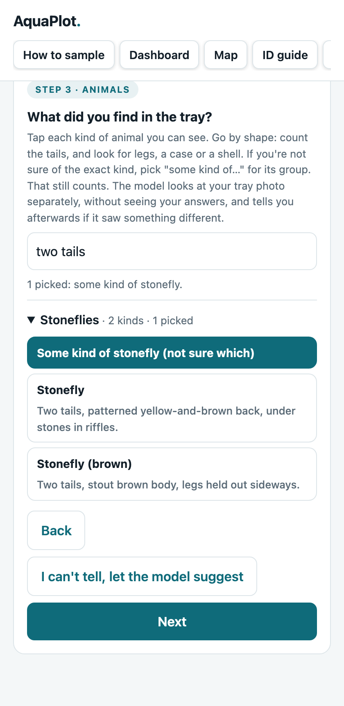
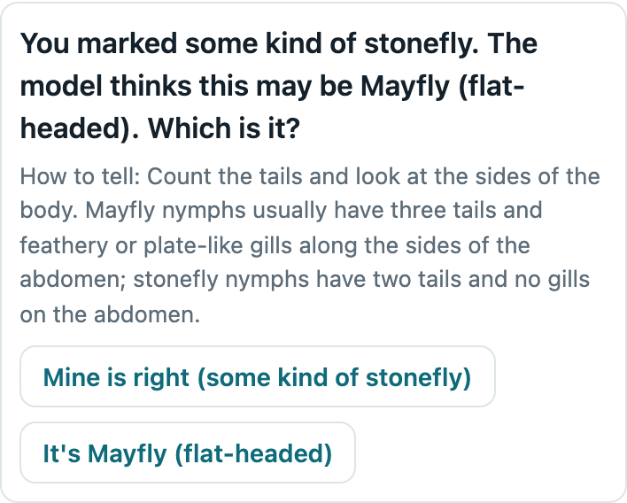
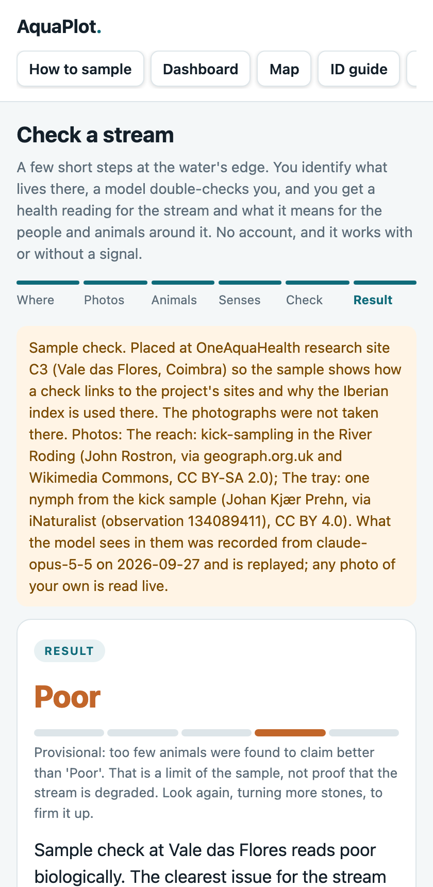
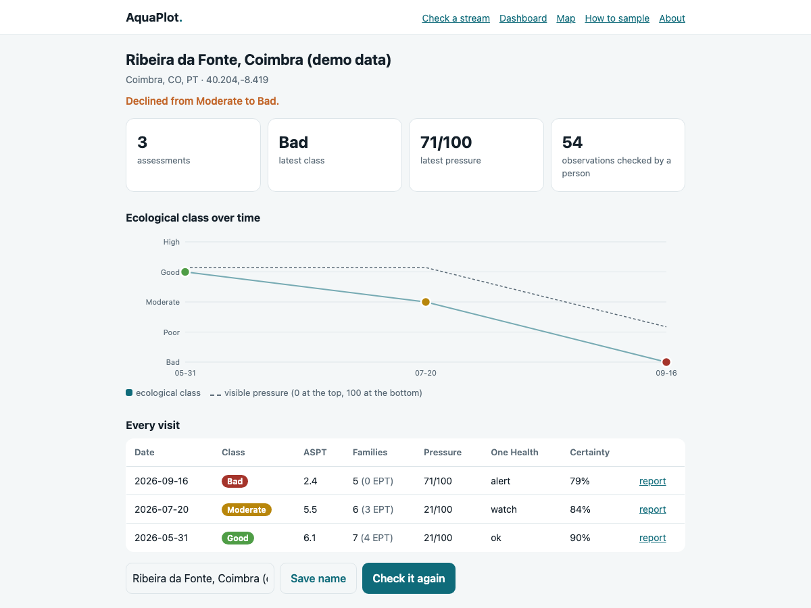

# AquaPlot

*Plot the health of your local water.*

Volunteers identify the animals living in their stream. An AI checks their answers without
seeing them, and published rules turn the result into a health reading.

**The problem.** The small animals living in a stream are the best sign of its health, and the
hardest thing for a volunteer to name. To a beginner, a flat-headed mayfly and a stonefly look
alike, and one wrong name can change a stream's reading. Letting an AI name them instead teaches
nobody anything, hides the AI's mistakes, and puts a machine's guess into a health record.
Track 3 of the hackathon states the problem directly: *citizen observations can be inconsistent
and error-prone.*

**Try it in 90 seconds:** run it (see [Run](#run)) and open `/try`. Real photos are already
loaded. You name the animal, and the AI, which never saw your answer, asks you to count its
tails. `/about` is a two-minute version of this page.

| You identify | The AI asks, blind | The reading | The trend |
|---|---|---|---|
|  |  |  |  |

A volunteer scoops gravel from a shallow, fast patch of an urban stream into a pale tray,
photographs it, and picks what they see from a guide organised by shape ("three tails",
"a case made of sand"). A vision model looks at the same photo **without seeing their
answers** and asks about anything it saw differently: *you marked a stonefly; this may be a
mayfly, so count the tails.* The volunteer decides. AquaPlot then gives a Water Framework
Directive screening band, a visual pressure score, and what the result means for the people
and animals around the stream. Every finding can be traced to the observation behind it, and
every health alert is held back until a person has confirmed what it rests on.

Built for the [IEEE OneAquaHealth Global Hackathon 2026](docs/HACKATHON.md), **Track 3:
AI-Supported Assessment**, which asks for AI that supports stream assessment without replacing
human judgement. See [track alignment](docs/HACKATHON.md#track-alignment).

```
tray photo ──▶ citizen picks the animals ─────────────────────┐  scored
           └─▶ observe.py (blind) ─▶ secondopinion.py ─▶ questions only, ranked by
                                                          whether the answer changes the band
reach photo ─▶ observe.py ─▶ habitat.py   visual pressures; a citizen answer beats the model's
coords ─────▶ places.py                   which municipality, which country, which index
     └──────▶ weather.py                  rain before the visit, rain and heat in the next 48 h
                 └─▶ bioindex.py          BMWP/ASPT, or IBMWP/IASPT in Portugal and Spain
                 └─▶ status.py            is any of this on an invasive list, here?
                        └─▶ onehealth.py  rules → ecosystem / human / animal findings + actions
                               └─▶ assessment ─▶ store.py    trends, sites, early warning
                                             ├▶ report.py   what you send your water authority
                                             ├▶ fhir.py     FHIR R4, HL7-validated
                                             └▶ csv/geojson for everyone else
```

## Why it's built this way

Four decisions shape the project, and you can see each one in the code.

**The person identifies; the model gives a blind second opinion.** Naming a 5 mm larva from a
phone photo is hard even for a trained ecologist with a hand lens, so AquaPlot never asks a
model to make that call. The volunteer's own identifications are what get scored. The model
sees the same tray without their answers and only produces questions: a likely mix-up, with
the feature that tells the two apart; an animal they may have missed; or a sensitive family it
could not find. Each question carries the band the stream would get if the model were right.
Because the model is asked blind, its agreement is independent evidence. If the volunteer takes
the model's answer, that is recorded as adopting it, never as agreement. Whether this catches
real mistakes can be measured, and [EVALUATION.md](docs/EVALUATION.md) explains how.

**The model observes; the rules decide.** A vision-language model is very good at saying *what
is in this picture*: whether the water is cloudy, whether that is a bloom, whether the bank is
concrete, whether that is a mayfly nymph. It is the wrong place to decide *whether this family
should keep their dog out of the water*. So `observe.py` returns only structured observations
in a fixed vocabulary, and every judgement comes from `bioindex.py` and `onehealth.py`: rules
over published indices that anyone can read, test and argue with. A finding names the rule that
fired, the evidence behind it, and the action it calls for.

**An alert waits for a human.** `onehealth.py` won't raise an alert based on model output that
no person has reviewed. It downgrades the finding to *concern*, says why in the evidence, and
the app puts that exact observation at the top of the confirmation queue. Confirming it raises
the alert, and a test covers this behaviour.

**Certainty is multiplicative and itemised.** This rule comes from the project AquaPlot grew
out of: a result must never look more confident than its weakest input. Every factor below 1.0
leaves a sentence behind, such as *8 of 12 habitat questions were answered*, *2 animals were
identified only to order* or *the coordinates could not be resolved to a municipality*, so you
can always see what lowered the number.

## Where this fits

OneAquaHealth already has a Citizen Science App. A volunteer at one of the project's research
sites (or at a personal site) records photos, the channel and banks, flow, water colour,
habitats, vegetation and an overall Good / Moderate / Poor judgement. The app doesn't ask what
lives in the water. AquaPlot is meant to sit beside it rather than replace it. It adds the part
the app leaves out, and what comes after: the animals, identified by the volunteer and checked
by a model; a One Health reading of what they found; a report an authority can act on; and a
record a health system can import.

It uses the project's own terms, taken from a snapshot of the project's public API:

- **The 106 research sites.** A check made within 200 m of one (Vale das Flores in Coimbra is
  `C3`) says so on the result, on the map and in every export, so a citizen's reading can be
  set beside the laboratory data the project files under the same code.
- **The app's own submission.** `GET /api/assess/{id}/oah-app` returns the check as the body
  the app submits (`CitizenSubmissionPutDTO`), in the app's answer codes. It lists where each
  field came from, and every answer that didn't translate, with the reason.
- **The project's FHIR implementation guide.** The export conforms to the OneAquaHealth IG
  ([`hl7-eu/oah`](https://github.com/hl7-eu/oah)): its Location profile, and its indicator
  Observation profile for macroinvertebrates, Diptera, foam/colour/smell, riparian vegetation,
  morphology, hydrology, algae and invasive organisms. With the IG loaded, it passes the HL7
  validator with no errors and no warnings.

Only what a person gave or confirmed goes into the project's formats. Anything only the vision
model saw stays in AquaPlot, marked preliminary. Every assessment can also be exported as CSV
and GeoJSON, so nothing is locked in.

## What works today

**The guided check** (`/`). Five short steps at the water's edge: where you are; two photos
(the stream and the sample tray); **the animals you found**; the two questions only a person
standing there can answer (smell, and who uses the water); and finally the places where you
and the model differ. The animal picker is grouped by shape, searchable by what you can see,
and offers "some kind of mayfly" when you can't tell the family. Each animal has a credited photo
of the stage you actually find in a tray (a nymph, not the winged adult); tap it to see it large.
The phone keeps the small photos for use without a signal, and each large one once it has been opened. Every habitat question is
rendered from `/api/form`, which comes from the same file as the model's prompt and the
server's validator, so the words on screen can't drift from the vocabulary the system accepts.
The result shows the band and what it means in plain language, who identified the animals and
how often the model independently agreed, findings for all three One Health domains, and
actions split by who can take them: you, your community, and your authority.

**The second opinion** (`secondopinion.py`). It asks three kinds of question: a disagreement,
with the feature that settles it (tails, gills, how it moves); something the model saw that you
didn't mark; and a sensitive family it couldn't find. They're ranked by whether the answer
changes the band. A suggestion that is a listed invasive species goes first, but it only enters
the invasive check if you say it was there. Whether you answer *keep mine* or *it's the
model's*, the model isn't called again. Band-changing disagreements left unsettled lower the
certainty, and the result says so.

**The biological index.** 53 macroinvertebrate families, scored under **BMWP/ASPT**, or under
the Iberian **IBMWP/IASPT** where the coordinates resolve to Portugal or Spain. Both tables were
checked against published ones. The band uses the WFD's five classes and is read from the mean
score, because one tray never comes close to the sampling effort an index's own total classes
assume. IBMWP's total class is shown next to it, labelled as reading low. The size of the
sample limits the claim: three families under one stone can't earn *High*, and two tolerant
families can't prove a stream is dead. An order-level answer ("some kind of stonefly") is
scored from the group median and flagged rather than thrown away. An animal the index doesn't
score (mosquito larvae under BMWP) is recorded but not scored, and still feeds the health rules.

**The One Health rules.** Fifteen rules that look at the index, the pressures, the invasive
check, the exposure answer and the weather before and after the visit. They cover harmful algal
blooms, signs of sewage, chemical sheen, mosquito breeding, snails that host parasites,
invasive-species biosecurity, habitat damage, resilience to heat and drought, silt, run-off
after heavy rain, heavy rain and heat in the forecast, and the wellbeing a stream in good
condition provides. Exposure raises the level: the same water quality is a more serious finding
where children paddle.

**The weather a visit can't see** (`weather.py`). The 48 hours before and after a check come
from Open-Meteo (free, no key) and are stored with it. Rain just before a visit means the
stream is at its dirtiest, so a paddle can wait. Sewage signs after rain point to a storm
overflow; in dry weather they point to a misconnected drain, and the authority is asked to look
in the right place. Heavy rain or heat in the forecast gives early warning. If the lookup
fails, you lose that context but still get the result.

**Trends and early warning** (`/dashboard`, `/map`, `/site/{key}`). Assessments are grouped on
a grid of roughly 100 m squares, so a second visit to about the same spot extends a series
instead of dropping a new pin. When you locate yourself near somewhere you've been before, the
app asks whether it's the same spot instead of deciding for you. Each site has its own page with
the ecological class plotted over every visit. The dashboard starts with where the water
stands, which sites have declined since their last visit, and what needs a budget, followed by
**the next 48 hours**: every site's latest reading re-run through the same rules with the
forecast. A site that showed sewage and has heavy rain coming is flagged before the rain
arrives. A review *replaces* a visit instead of adding one, so the volunteers who check the
model's work most carefully can't create false trends by doing it.

**Something to actually send** (`/api/assess/{id}/report`). Every serious finding tells the
observer to report it, and this is what they report *with*: a self-contained incident report,
printable or as Markdown to paste into a contact form. It opens with what is being asked for,
says whether each observation came from a person or from the model, includes the site's
history when there is one, and states its own limits in the body rather than in a footnote
nobody forwards. There's also `/api/export.csv` for the spreadsheet a council officer will
actually open, and `/api/export.geojson` for QGIS.

**It works with no signal.** Mobile coverage often fails on a riverbank under trees, and a tool
that needs a connection at the moment of observation ends up being used from the car park
afterwards, from memory. A service worker caches the page and everything an assessment needs.
If a submission can't reach the server, the answers and photos are kept on the phone and sent
when coverage returns. The queue is visible and can be sent by hand, because this is data
somebody walked to a stream to collect. The app can be installed to a home screen.

**A protocol people can hold** (`/field-guide`). What to bring, safety first, how to find a
riffle and why it's the fair place to judge a stream, how to take a sample even without a net,
how to photograph a tray so the animals show up, an identification table with the best news
first, and check-clean-dry. It's printable, because a river-day group needs paper.

**FHIR R4 export** (`/api/assess/{id}/fhir`), **validated with the official HL7 validator: no
errors, no warnings.** FHIR is the standard format health systems use to exchange records. The
assessment is exported as a Bundle containing a `Location`; an `Observation` panel with the
index, EPT richness (the number of mayfly, stonefly and caddisfly families), the band, who
identified the animals and what the second opinion found; the raw survey and the habitat form
as their own Observations; one Observation per One Health domain with an HL7 interpretation
code; a `Flag` for each alert; and a `Provenance`. Every project code belongs to one
CodeSystem generated from the app's own vocabularies and served at
`/api/fhir/CodeSystem/stream-health`. No code pretends to be LOINC. Validated examples are in
[docs/fhir/](docs/fhir/); see [docs/FHIR.md](docs/FHIR.md).

**A way to find out whether it works** (`scripts/evaluate_observer.py`). It calls the model
once per labelled photo, then measures what the model saw, how many simulated volunteer
mistakes the second opinion would catch, and how many questions a correct list still gets.
`scripts/fetch_inat_eval.py` downloads a starter set of openly licensed larva and nymph photos
from iNaturalist. See [docs/EVALUATION.md](docs/EVALUATION.md).

**A sample check anyone can try** (`/`, *Use the sample photos*). Two openly licensed photos,
one of a stream and one of a tray with a single nymph in it, placed at OneAquaHealth research
site C3. A vision model's reading of each was recorded once, with the same prompt, and is
replayed when those photos are submitted, so you can see the blind second opinion on a server
with no model key. The page, the result, the report and the FHIR Provenance all label the
replay as a recording; any other photo is read live. Credits are in `data/samples.json`.

**It works with no model at all.** With no API key and no local model, nothing reads the photos
and nothing double-checks the identifications. The volunteer answers the form themselves, and
the band, pressure score, findings, actions, trends and FHIR export are all calculated the
same way. The model makes AquaPlot safer for a beginner, but AquaPlot works without it.

## Run

Python 3.12 or newer. With [uv](https://docs.astral.sh/uv/):

```sh
uv venv --python 3.12 .venv
uv pip install --python .venv/bin/python -e ".[dev]"
.venv/bin/python -m pytest                       # 303 tests, no network, no model
.venv/bin/uvicorn aquaplot.app:app --reload        # http://127.0.0.1:8000
```

Open `/about` for the two-minute tour, `/try` for the sample check, `/` to check a stream,
`/site/{key}` for one spot's history, `/dashboard` for the insights, `/map` for the map,
`/field-guide` for the sampling protocol, `/developers` to test with your own Claude key, and
`/docs` for the interactive API reference.

A fresh install has an empty dashboard, which is a poor first impression for a tool built on
the idea that a *series* of readings is worth more than one. Start the server with
`AQUAPLOT_SEED_DEMO=1` and an empty database is filled at startup with a small, clearly
labelled demo dataset across the five research cities, dated over five months, with one site
that declines and one that improves (`src/aquaplot/demo.py`). The Render blueprint sets this,
because a free instance's disk is wiped on every restart. You can also post the same visits to
a running server through the public API:

```sh
.venv/bin/python scripts/seed_demo.py --url http://127.0.0.1:8000
```

### Choosing a vision model

| `ANTHROPIC_API_KEY` set | Ollama running with a vision model | Backend |
|---|---|---|
| yes | any | Claude (`claude-opus-5`; override with `CLAUDE_MODEL`) |
| no | yes (`ollama pull qwen2.5vl:3b`) | local model via Ollama (`OLLAMA_MODEL` to pick one) |
| no | no | none: the citizen fills the form, everything else is unchanged |

The three are not interchangeable. A small local model is enough to tell a tray from a
riverbank, and on the photographs we measured it named no invertebrate families at all, so it
produces no second opinion rather than a weak one — see
[the model-layer results](docs/EVALUATION.md#results). Treat Ollama as the offline and
keyless path, not as the double-check.

`AQUAPLOT_OBSERVER=claude|ollama|none` forces a choice and `/api/health` reports which is
active. `AQUAPLOT_DB` sets the SQLite path (default `aquaplot.db`). `AQUAPLOT_CLASSIFY_LIMIT`
caps assessments per client address per 10 minutes (default 20, `0` disables) so a public
demo cannot drain an API key. `AQUAPLOT_WEATHER=off` stops the Open-Meteo lookups.

**Testing with a real key in public.** With Claude as the backend, each tester gets a few *live
photo readings*: one per check whose photos go to the model. `AQUAPLOT_LIVE_PER_TESTER` (default 2)
counts per browser, `AQUAPLOT_LIVE_PER_NETWORK` (default 10) per network address per day, and
`AQUAPLOT_LIVE_PER_DAY` (default 40) for the whole server per day; `0` turns one off. The counts
live in the database, so a restart does not reset them (except on a host whose disk is wiped). The
sample photos and reviews never use a reading. Past a limit the check still runs, by hand, and says
why; the check page shows each tester how many they have left. A local Ollama model is not limited.
Set a spending limit on the key in the Anthropic console as well: it is the one limit nothing can
get round.

**Testing with your own key.** The Developers page (`/developers`) saves a Claude API key in that
browser only. Checks from that browser send it in the `X-AquaPlot-Claude-Key` header, and Claude
reads their photos on it, whatever backend the server has. The server uses the key for that one
request and never stores, logs or returns it, and those checks use none of the server's live
readings. The page can ask Anthropic whether the key works, which costs nothing.

## Where things live

| Path | What |
|---|---|
| `src/aquaplot/observe.py` | The vision model's only job: photo → structured observations. Three backends, one schema, and the labelled replay for the sample photos. |
| `src/aquaplot/secondopinion.py` | The citizen's list against the model's blind one: questions, the feature that settles each, the band at stake. |
| `src/aquaplot/bioindex.py` | BMWP/ASPT and IBMWP/IASPT, index choice by country, WFD bands, the effort cap, the coarse-identification rule. |
| `src/aquaplot/habitat.py` | The visual field form: scoring, validation, model-vs-citizen precedence. |
| `src/aquaplot/onehealth.py` | The rule engine. Every finding carries a rule id, its evidence and an action. |
| `src/aquaplot/assess.py` | Puts the stages together; the certainty rule; the confirmation queue; `reassess` for review. |
| `src/aquaplot/places.py` | Coordinates → administrative chain, anywhere; the OneAquaHealth research cities. |
| `src/aquaplot/status.py` | Species + place → Native / Invasive / Naturalized, with the listing jurisdiction. |
| `src/aquaplot/weather.py` | The 48 hours either side of a visit and the 48-hour outlook, from Open-Meteo. Injectable, stored with the check. |
| `src/aquaplot/allowance.py` | Live Claude readings on a public test: a few per tester, a ceiling per network and per day, counted in the store. |
| `src/aquaplot/demo.py` | The labelled demo dataset, seeded into an empty store at startup with `AQUAPLOT_SEED_DEMO=1`. |
| `src/aquaplot/store.py` | SQLite: sites on a ~100 m grid, trends, the alert feed, badges. |
| `src/aquaplot/fhir.py` | FHIR R4 Bundle export, conforming to the OneAquaHealth IG profiles, and the project CodeSystem. |
| `src/aquaplot/oah.py` | The OneAquaHealth research sites, and a check as the project's Citizen Science App submission. |
| `src/aquaplot/evaluation.py` | Scores stored model output on labelled photos: accuracy, mistakes caught, false alarms. |
| `src/aquaplot/report.py` | The incident report a citizen sends an authority, as Markdown and as a printable page. |
| `src/aquaplot/data/bioindicators.json` | 53 families: BMWP and IBMWP scores, what to look for, what finding it means. |
| `src/aquaplot/data/habitat_indicators.json` | The field form. Drives the prompt, the validator, the UI and the scoring. |
| `src/aquaplot/data/status_seed.json` | 101 listed invasives with jurisdiction, habitat and One Health relevance. |
| `src/aquaplot/data/pilot_sites.json` | The five OneAquaHealth research cities. |
| `src/aquaplot/data/oah_reference.json` | Snapshot of the OneAquaHealth public API: 106 research sites and the Citizen Science App's answer codes. Refresh with `scripts/fetch_oah_reference.py`. |
| `src/aquaplot/data/guide_photos.json` | Who took each ID photo, under which licence, and the iNaturalist observation it came from. The photos themselves are in `static/guide/`; refresh or replace one with `scripts/fetch_guide_photos.py`. |
| `src/aquaplot/data/field_guide.md` | The sampling protocol. Served at `/field-guide`; one copy, read by people and by the program. |
| `src/aquaplot/static/about.html` | AquaPlot in two minutes, at `/about`: the problem, what you'll see when you try it, and what is and isn't claimed. `/try` opens the sample check. The first screen is a three.js stream (from cdnjs, loaded after the page) with the logo over it; scrolling flies the camera up to look straight down on it, and the page runs either side of the river. It is all drawn by shaders, with no images or models, drops its resolution on a device that cannot keep up, holds still for reduced motion and falls back to a gradient without WebGL. The logo on every page links here. |
| `src/aquaplot/static/check.html` | The guided citizen workflow, including the animal picker and the second-opinion cards. |
| `src/aquaplot/static/site.html` | One spot: its series, its chart, every visit's report. |
| `src/aquaplot/static/dashboard.html` | The insights dashboard. |
| `src/aquaplot/static/developers.html` | The Developers page, at `/developers`: saves a Claude API key in this browser so its checks get a live reading, and checks the key with Anthropic. |
| `src/aquaplot/static/theme.js` | The light/dark switch and the header's ⋮ menu, shared by every page: applies a saved choice before first paint, draws the switch, announces changes to pages that colour things in script, and styles the menu and closes it on a click elsewhere or Escape. Each page's header has Check a stream, Dashboard and Map in the bar; How to sample, CSV, the API reference, Developers, About and the switch are in the menu (`tests/test_header.py` keeps the copies the same). |
| `src/aquaplot/static/guide.js` | The ID guide and the photo viewer, shared by every page: "ID guide" in the ⋮ menu opens it over whatever page you are on, and the check page's animal picker enlarges its photos in the same viewer and lists the same families. Cached with the shell by `sw.js`, so it works offline on the check page. |
| `src/aquaplot/static/sw.js` | Service worker: the app shell and the vocabularies, cached for the riverbank. |
| `src/aquaplot/static/map.html` | Leaflet map: AquaPlot sites and the OneAquaHealth research sites over iNaturalist layers. No build step. |
| `src/aquaplot/{identify,pipeline,schema,inputs,area,inat}.py` | Inherited from SpeciesGuard; see lineage below. |

## Documentation

- [docs/FIELD-GUIDE.md](docs/FIELD-GUIDE.md): how to check a stream, including what to bring, safety, sampling and photographing a tray. Also served at `/field-guide`.
- [docs/API.md](docs/API.md): every endpoint, with examples. Interactive version at `/docs`.
- [docs/ASSESSMENT.md](docs/ASSESSMENT.md): how a photo becomes a band, stage by stage, who identifies, and what the certainty number means.
- [docs/EVALUATION.md](docs/EVALUATION.md): how the second opinion is measured, and how to read the numbers honestly.
- [docs/ONE-HEALTH.md](docs/ONE-HEALTH.md): every rule, its trigger, its evidence and its action.
- [docs/FHIR.md](docs/FHIR.md): the resources, the codes, how to validate it yourself, and what would have to happen to make it standard.
- [docs/HACKATHON.md](docs/HACKATHON.md): track alignment, the judging criteria, the build timeline and the timed demo script.
- [docs/DEVPOST.md](docs/DEVPOST.md): the submission text, section by section.
- [CONTRIBUTING.md](CONTRIBUTING.md): how to correct a rule, add a family, or swap in a country-specific index.
- [docs/AREA-VIEWER.md](docs/AREA-VIEWER.md), [docs/CLASSIFIER.md](docs/CLASSIFIER.md): the inherited features.

## Lineage

AquaPlot is a fork of **SpeciesGuard** ([BabayoAP/nativeview](https://github.com/BabayoAP/nativeview)),
a terrestrial invasive-species classifier the same author built for NextStep Hacks 2026.
What carried over: the pipeline shape, the certainty rule and its insistence on an evidence
trail, the cached iNaturalist client, the pluggable model backends, and the area viewer.
Everything freshwater is new: the citizen-first identification and the blind second opinion,
both biotic indices, the field form, the One Health rule engine, the assessment pipeline and
its review loop, persistence and trends, the authority report, FHIR and tabular export, the
evaluation harness, the generalised geography, the offline field app, and every page except
the classifier. By `git diff --shortstat` against the imported commit, that is about 6,900
lines of new Python and 2,100 of new interface, and 235 of the 303 tests. SpeciesGuard's code
was written on Sep 16–17, 2026, inside this hackathon's Sep 16–30 development window
([its commit history](https://github.com/BabayoAP/nativeview/commits)). The original project's
PRD is kept at [docs/PRD-SPECIESGUARD.md](docs/PRD-SPECIESGUARD.md) and its submission notes at
[docs/HACKATHON-NEXTSTEP.md](docs/HACKATHON-NEXTSTEP.md), so the line between the two projects
is documented.

## What this is not

- **Not a Water Framework Directive classification.** A formal classification needs a
  standardised three-minute kick sample, laboratory identification and a comparison with a
  reference site. AquaPlot is a screening tool, and every result says so.
- **Not a medical, water-quality or regulatory determination.** Findings name the authority
  that can make one and tell the user to contact it.
- **The second opinion has not yet been measured on real trays.** The harness to measure it
  exists and is documented. Until it has been run, "it catches volunteers' mistakes" is what
  it's designed to do, not a measured result.
- **The certainty factors are informed guesses (priors), not measured calibration.** They rank
  outcomes sensibly and explain themselves, but no calibration study has been run.
  `assessment_version` changes whenever the rules do, so results stay comparable.
- **The seed invasive list is unverified.** It cites Cal-IPC, CDFW, USGS, UC IPM and EU
  Regulation 1143/2014, and every entry must be re-checked against those authorities before
  it is used for anything beyond screening.
- **Two indices, not every national method.** BMWP everywhere, IBMWP in Portugal and Spain.
  Portugal's WFD method is the multimetric IPtI and Italy's is IBE; neither is implemented.
  Adding an index takes a score column and a few lines (see [CONTRIBUTING.md](CONTRIBUTING.md)).
  The catalogue has 53 families; IBMWP scores 125, and a family outside the catalogue is
  reported as unmatched rather than guessed.
- **The FHIR CodeSystem is provisional.** It is published, complete and validated, but it is a
  project terminology marked `draft`. No code pretends to be LOINC, and
  [docs/FHIR.md](docs/FHIR.md) states exactly what would have to happen to make it standard.

## Data sources

| Source | Used for | Terms |
|---|---|---|
| [iNaturalist API](https://api.inaturalist.org/v1/docs/) | Taxonomy, establishment means, administrative places, sightings | Free, attribution, ~1 req/s |
| iNaturalist photos, one per family | The photos in the animal picker and the ID guide | CC0, CC BY or CC BY-SA; credited beside each photo and in `data/guide_photos.json` |
| BMWP family scores (Armitage et al. 1983) | The biological index | Published methodology, widely reproduced |
| IBMWP family scores (Alba-Tercedor et al. 2002; MAGRAMA 2011) | The index in Portugal and Spain | Published methodology; checked against the tables in the `biomonitoR` R package |
| EU Regulation (EU) 1143/2014 Union list | Invasive species of Union concern | Public |
| Cal-IPC Inventory, CDFW, USGS NAS, UC IPM | Inherited Californian invasive entries | Public lists |
| [Open-Meteo](https://open-meteo.com) | Rain and temperature either side of a visit, and the 48-hour outlook | Free, no key, CC BY 4.0 |
| Sample photos: John Rostron (geograph.org.uk, CC BY-SA 2.0); Johan Kjær Prehn (iNaturalist, CC BY 4.0) | The sample check | Credited in `data/samples.json` and on the page |
| [OneAquaHealth field protocols](https://zenodo.org/records/20344421) | The shape of the site-characterisation form | CC, cited |
| [Global Forest Watch](https://www.globalforestwatch.org/) (Hansen/UMD/Google/USGS/NASA) | Tree-cover loss tiles | CC BY 4.0 |
| Esri World Imagery and Reference | Basemap and labels | Esri attribution |

## Licence

MIT. See [LICENSE](LICENSE).
